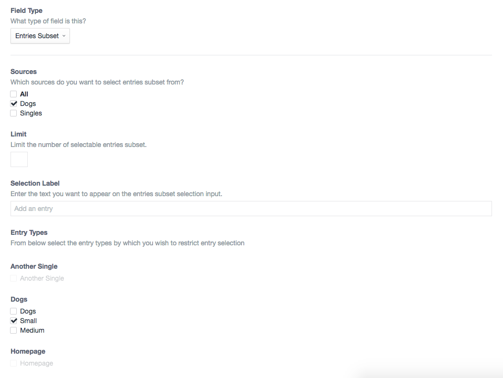

# Entries Subset plugin for Craft CMS 3.x

Craft field type plugin that extends the core Entries field type to give extra settings with ability to restrict by entry type, author or author's user group.

**NOTE**: Version 1.2 is only compatible with Craft CMS 3.1.2.2 ownwards, for pre 3.1 support please use v1.1

## Requirements

This plugin requires Craft CMS 3.0.0-RC1 or later.

## Installation

To install the plugin, follow these instructions.

1. Open your terminal and go to your Craft project:

        cd /path/to/project

2. Then tell Composer to load the plugin:

        composer require nfourtythree/entriessubset

3. In the Control Panel, go to Settings → Plugins and click the “Install” button for Entries Subset.

## Entries Subset Overview

This field type is an extension of the built in `Entries` field type. It allows you to specify extra criteria (`EntryType`, `User`, `UserGroup`) in which to restrict the available entries for selection.

#### Examples
You might have a News section which has a few entry types. One of the entry types is "Press Release", you may then have a block where you would like the user to be able to select a "Featured" press release. With the standard `Entries` field type they would be able to select anything from the News section, with this plugin you are able to only allow the selection of those with the "Press Release" entry type.

You might want to limit selection of entries only authored by users in the "Development" or "Copywriters" user groups, this is now possible.

## Using Entries Subset

When creating a new field the extra options for `EntryType` will appear when selecting `Entries Subset` fieldtype

## Entries Subset Roadmap

Some things to do, and ideas for potential features:

* Tidy all the things
* Make it more obvious what the criteria is when selecting entries in the ElementSelectorModal

Brought to you by [Nathaniel Hammond (nfourtythree)](http://n43.me)
